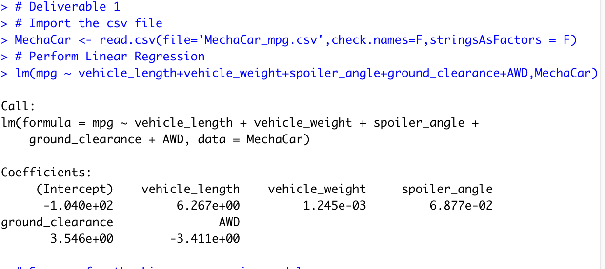
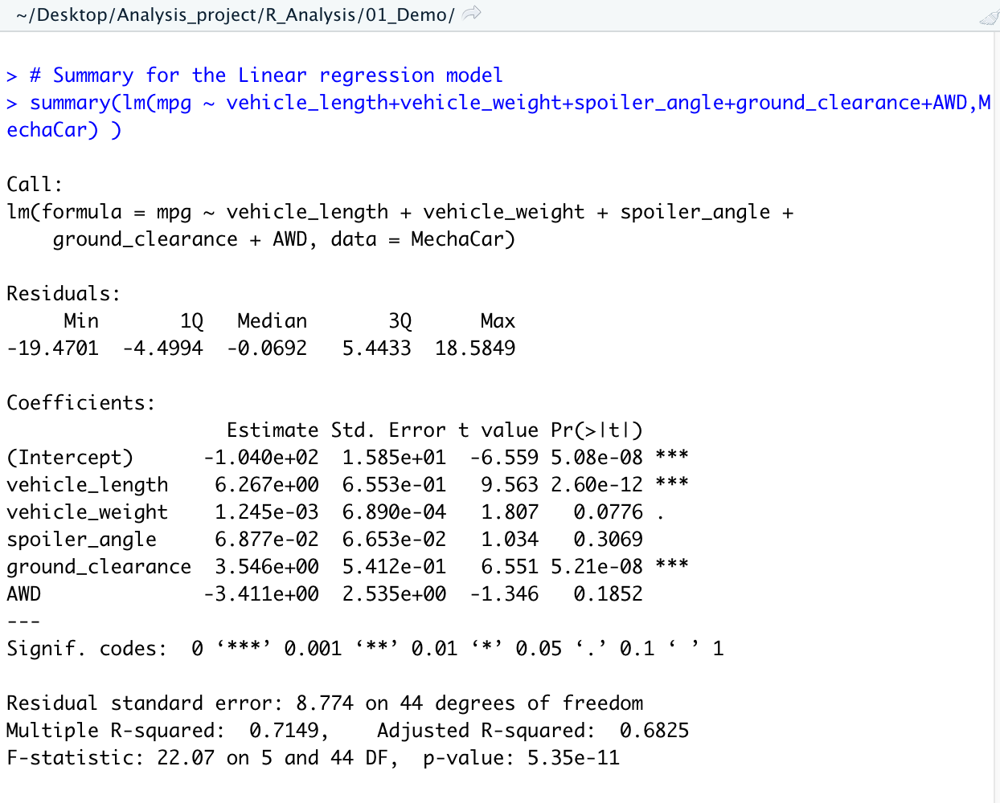
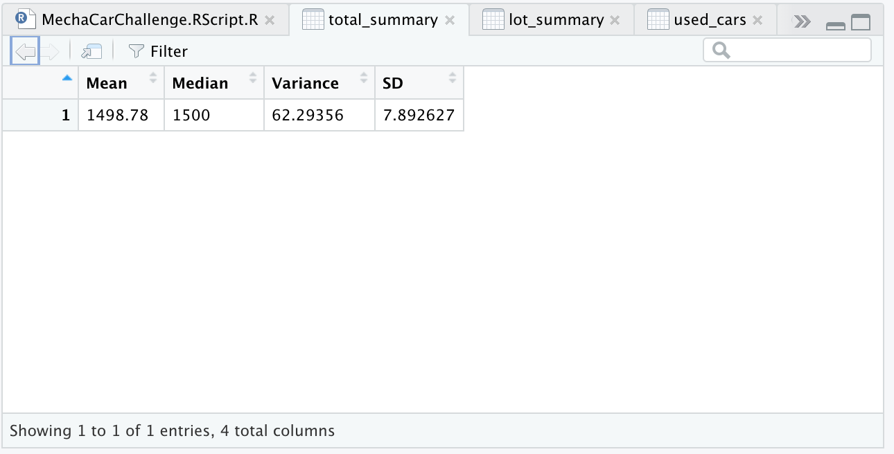
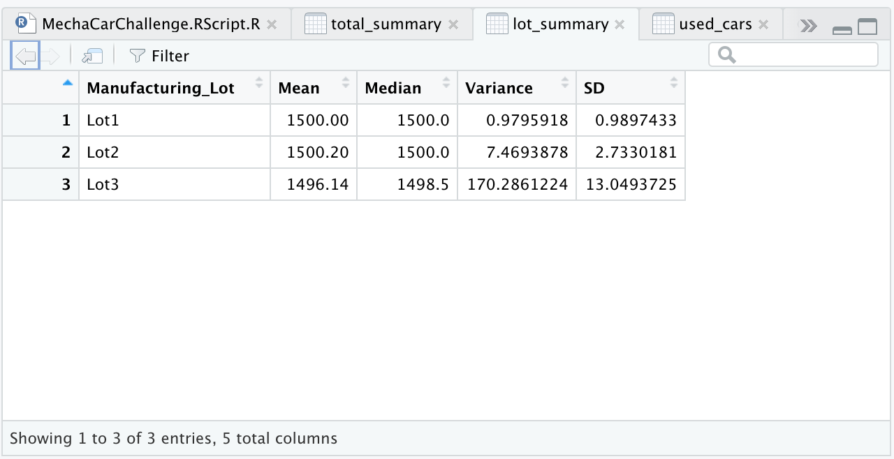
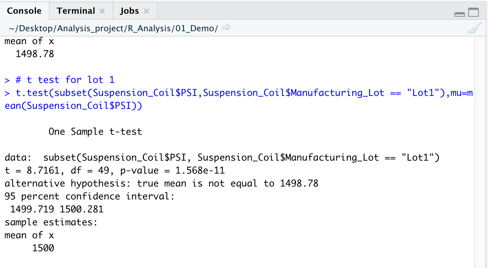
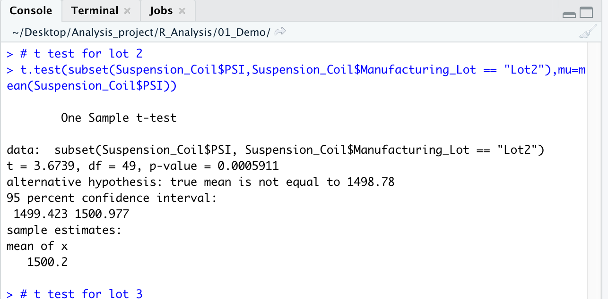
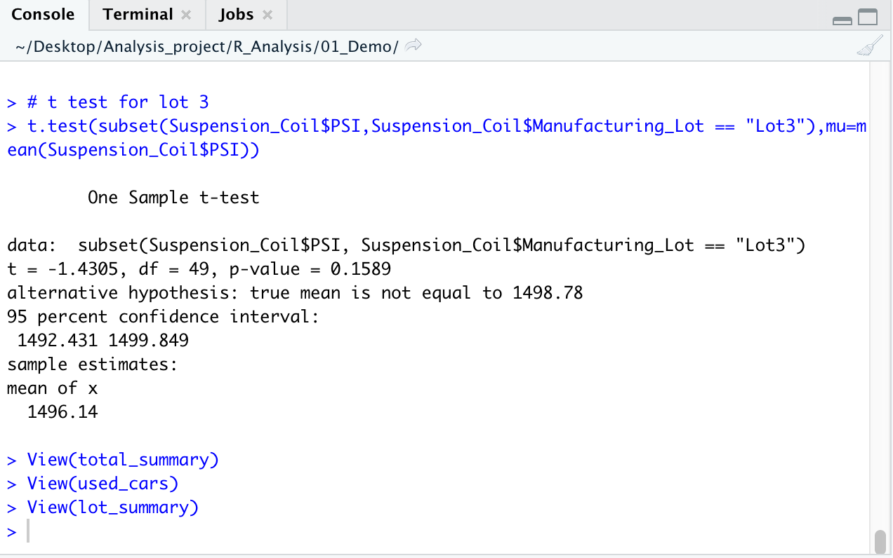

# MechaCar_Statistical_Analysis
Perform multiple linear regression analysis to identify which variables in the dataset predict the mpg of MechaCar prototypes
Collect summary statistics on the pounds per square inch (PSI) of the suspension coils from the manufacturing lots
Run t-tests to determine if the manufacturing lots are statistically different from the mean population
Design a statistical study to compare vehicle performance of the MechaCar vehicles against vehicles from other manufacturers. For each statistical analysis, you’ll write a summary interpretation of the findings.
# Overall preview of the project
## Deliverable 1: Linear Regression to Predict MPG
## Deliverable 2: Create Visualizations for the Trip Analysis
## Deliverable 3: T-Tests on Suspension Coils
## Deliverable 4: Design a Study Comparing the MechaCar to the Competition
## Results
## Linear Regression to Predict MPG
### 

###

## Summary Statistics on Suspension Coils
### 

###

## T-Tests on Suspension Coils
###

###

###

## Study Design: MechaCar vs Competition
